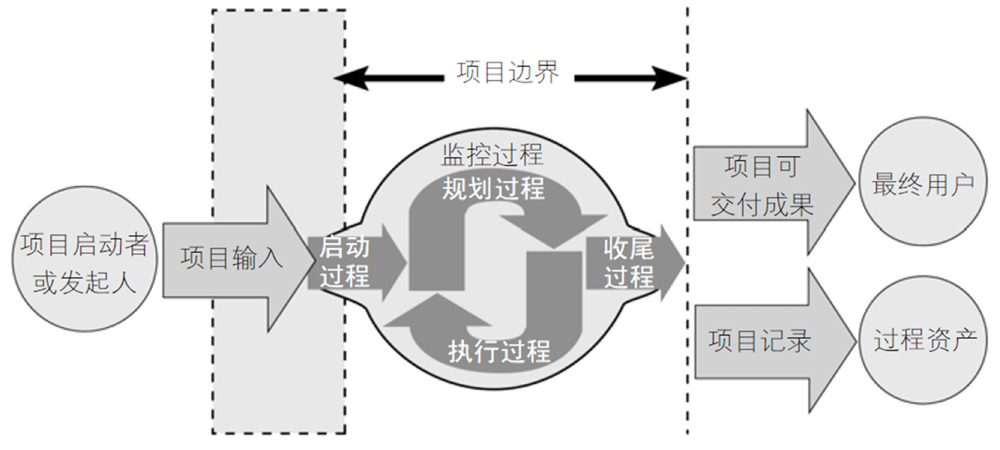

### 第一章 项目与项目管理概述

**项目管理学科的核心：从实践中来，到实践中去；听懂的只是知识，反复实践后才是能力，实践就是不停地犯错和尝试。**

#### 项目

**项目**是为创造独特的产品、服务或成果而进行的“临时性工作”。

##### 项目三个特性

**独特性**：历史上不存在完全相同的项目。

**临时性**：有明确的起止时间。

**渐进明细**：通过计划和控制实现。

##### 什么不是项目

**生产、运营、行政**

##### 项目的约束

**范围**、
**时间**、
**成本**、

#### 项目管理

##### 何为管理

**管事**：知识、工具、方法

**理人**：思想、价值观（沟通）

##### 何为项目管理

**项目管理**：将知识、技能、工具与技术应用于项目活动，以满足项目的要求。

##### 项目管理十要素

**范围、时间、成本、质量、风险**（事）

**人力资源、沟通、采购、干系人**（人）

**整合**

##### 项目管理五大过程

**启动过程、规划过程、执行过程、监控过程、收尾过程**

##### 何为IT管理项目

IT项目：为创造**独特**的IT产品、服务或成果而进行的临时性工作。

##### 项目管理的独特性

**目标不明确、需求变化频繁、智力密集型**

#### 项目经理

##### 何为项目经理

项目经理：和项目发起人、项目团队及与项目相关的其他人一起为达到项目目标而努力工作。

项目经理经常会扮演领导者和管理者的双重角色，既是领导者又是管理者。

领导者[Leader]在激励人们达到目标时专注于长期以及整体的目标，做正确的事情；
管理者[Manager]关注为达到具体目标所需要的日常细节，正确地做事情

##### 项目经理应具备的素质

**项目管理知识、通用管理素养、应用领域知识、项目环境、人际关系能力**