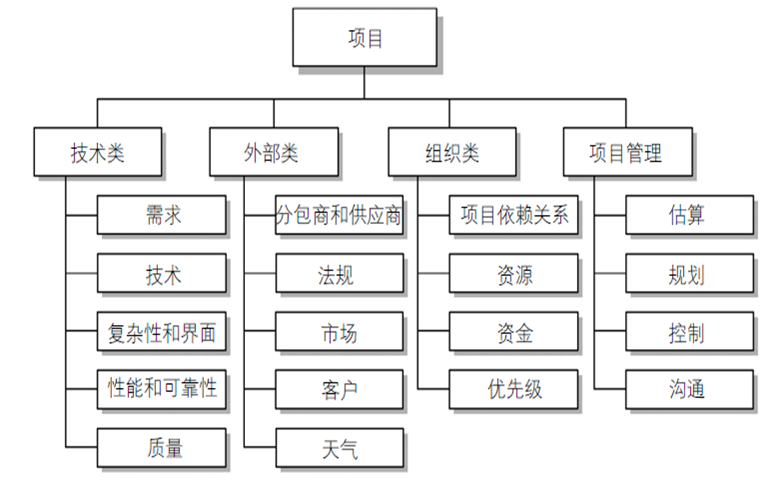

### 第二章 项目来源、论证、立项与启动

#### 项目来源

**一、为外部甲方客户做项目**（甲方乙方优势劣势互补）

**二、研发新产品**（服务互联网大众）

#### 项目论证、立项

##### 一、承接外部IT项目的论证与立项

- 甲方客户提出**原始需求**
- 乙方深入分析后提出合理建议及**解决方案**
- 双方签订合同
- 乙方**启动项目**实现方案

###### 什么样的解决方案才是用户真正需要的？（解决客户“开源与节流”的问题 ）

- 扩展销售渠道，例如为苏宁电器开发苏宁易购
- 增加知名度，例如数字北戴河
- 增加客户满意度，例如客户管理系统（CRM）
- 节约成本，例如远程会议系统 – 精简工作流程，例如内部信息化系统
- 减少资源浪费，例如企业资源计划系统（ERP） 

###### 承接外部项目的方式

- 招投标（议标、邀请招标、公开招标）
- 客户关系好，内定（如：已有良好合作关系下的后续项目合作）
- 业务人员主动拓展

##### 二、研发新产品项目的论证与立项

###### 产品构思（商业论证）做什么？

- 用户需求（要解决的问题）
- 产品愿景（核心定位）
- 商业机会（盈利模式等）
- 用户分析（用户画像等）
- 技术可行性分析（语言、框架等）
- 资源分析（资金、设备、人力等）
- 风险分析（贯穿整个项目的风险）
- 收益分析（净现值分析）

###### 如何发现问题（用户需求）

如何找到大众用户的需求？(**离苦得乐**)

- 为什么人们会买账？这里有两个最基础的答案，人们通常把钱花在两件事上：第一，他们经常把 钱花在对抗痛苦上，第二，他们把钱花在追求享乐上。 “做痛苦的生意”常常要比“做快乐的生 意”要好。            --来自36氪， http://www.36kr.com/p/141719.html 

###### 如何发现问题（用户需求-更高的追求）

- 优秀的IT产品除了满足上述所说的“离苦得乐”之外，更重要的是要“**以人为本、 超越技术**”
- 从“能用”提升至“好用”，甚至“贴心”，以技术为核心趋向人文艺术为灵魂 

###### 产品愿景和商业机会

- 产品愿景（定位）：一句话（或一段话）描述产品能给予**用户的深层体验**。 
- 商业机会：针对“问题”，提出改进的方案，并构建相应的商业模式（**如何赚钱**）。 

###### 用户分析（用户画像和关于品牌推广运营）

- 分析产品所服务的主要人群的特点，重点是用户的“痛处”或“愿望”，同时考虑 其经济状况、消费观念、行为特征等多种因素，绘制出清晰的**用户画像**
- 关于用户代言（**用户特征体现**）

###### 技术可行性分析

- 分析产品要采用的技术、平台、软硬件网络支持等，分析是否存在技术上的难点等。

###### 预估资源需求

- 人员（什么样的人，需要数量等）、资金（直接成本、间接成本、储备资金）、设备、设施、信息、技术

###### 风险分析

- 风险是一种**不确定事件或状况**，如果发生将会对至少一个项目目标（如范 围、时间、成本或质量）产生**正面**或**负面**的影响。

###### 收益分析

**项目生命周期**

项目的财务分析必须考虑完整的生命周期。 
- 若项目的成果是产品，则产品会有销售生命周期；
- 若项目的成果是服务，则产品会有运营生命周期；
- 项目成果开发周期加上销售或运营的周期构成了完整的项目生命周期。

**一、净现值分析(NPV - Net present Value)**

- 净现值[Net present value ] ：净现值指未来资金(现金)流入(收入)现值与 未来资金(现金)流出(支出)现值的差额。（考虑了资本的时间价值，即: 今天 的1元钱 > 明天的1元）
- 折现率：将未来有限期预期收益折算成现值的比率
- 如果一个项目的财务价值，作为选择项目的一个关键标准，那么组织应该只 考虑那些能产生正净现值的项目
- 仅从财务角度看，NPV越高的方案越好

**净现值NPV计算步骤**

1. 确定项目和产品完整生命周期以及预计的成本和收益 
2. 确定**折现率**[discount rate]
3. 计算NPV 1. 计算折现因子：**1/(1+r)t**     r是折现率，t是第几年 2. 将每年收益与对应的折现因子相乘后累加，减去依此算出的成本累加，即得到 
**NPV=∑t=0…n预计收益t/(1+r) t —∑t=0…n预计成本t/(1+r) t** 
4. 注意:有些组织将项目成本的投资年作为第0年，而不是第1年，并且对 第0年的成本并不折现；有人以负数形式记录成本，而有些则不是 。
• 注意自己所在组织采用的参数标准 

**净现值分析是一种适用于对跨越多个年份的项目 比较现金流的方法**

**二、投资回报率分析(ROI - Return on Investment)**

- **投资回报率**[Return on investment (ROI)] 是项目收益减去成本后 ，再除以成本的结果
– ROI = (折现收益总额 – 折现成本总额)/折现成本总额
- **ROI越高越好**
调查显示：投资项目时，约有**50%**的组织需要投资回报率数据

**三、投资回收期分析(Payback Period)**

- 另一个重要的财务考虑是投资回收期
- **投资回收期**[Payback Period] 亦称“投资回收年限”。投资项目投产后获 得的收益总额达到该投资项目投入的投资总额所需要的时间 (年限)。
- 回收期也就是不断增长的收益超过不断增长和继续花费的成本时经历多长时间（ 投资与收益的一个交叉点）
- 投资回收期可分为静态投资回收期（不考虑资金时间价值）和动态投资回收期
- **回收期长短问题**
- 许多组织都希望在不影响整体收益的情况下，IT项目的回收期尽可能的短